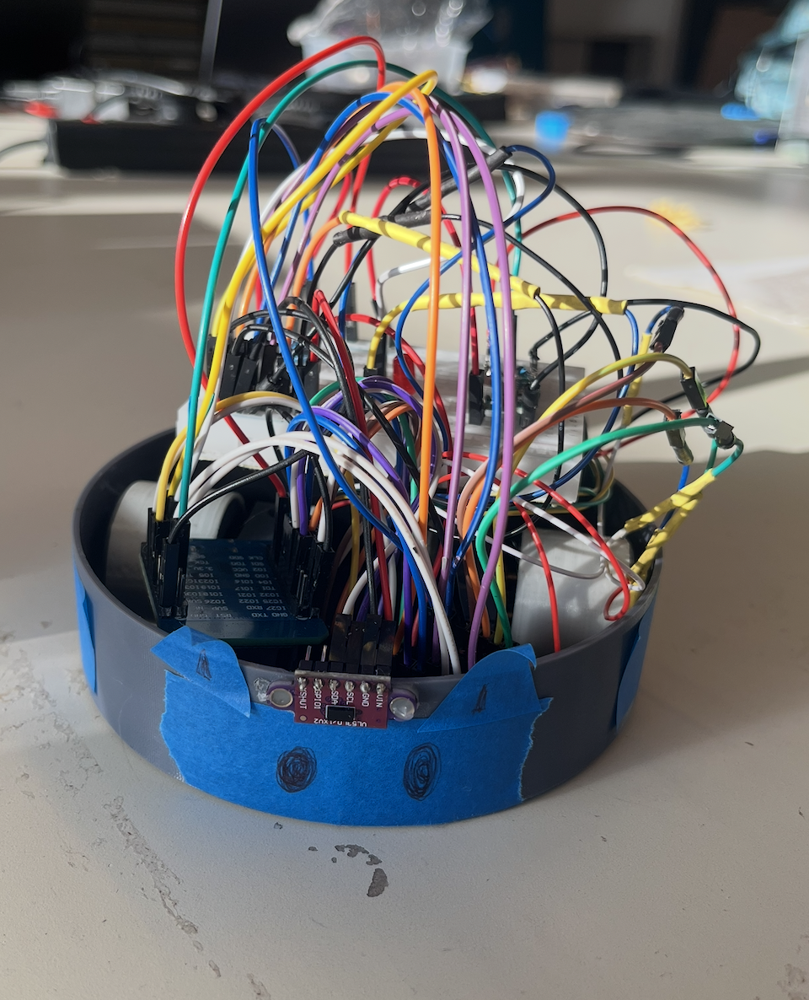
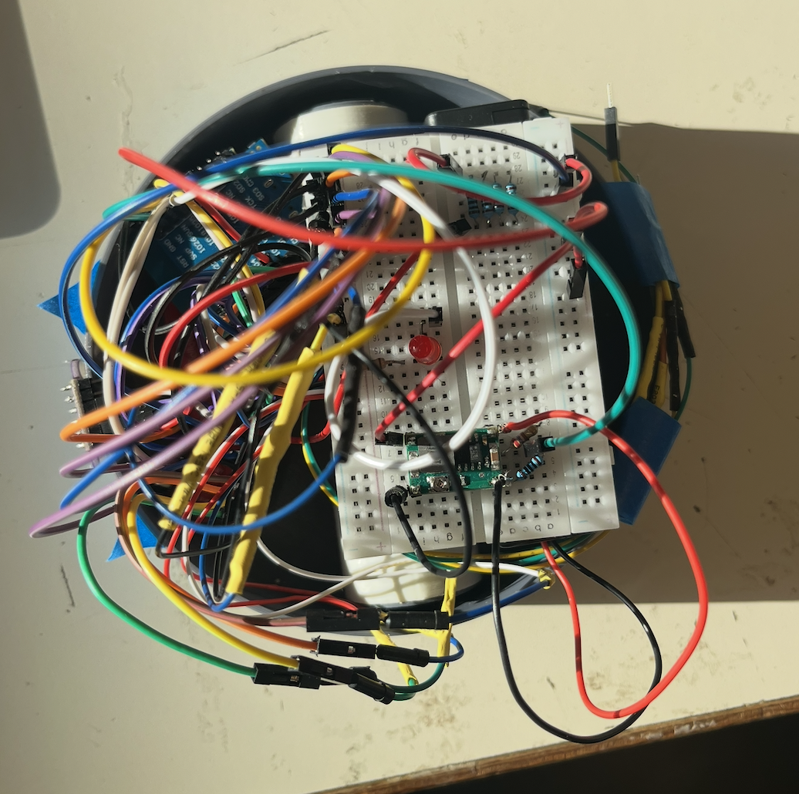
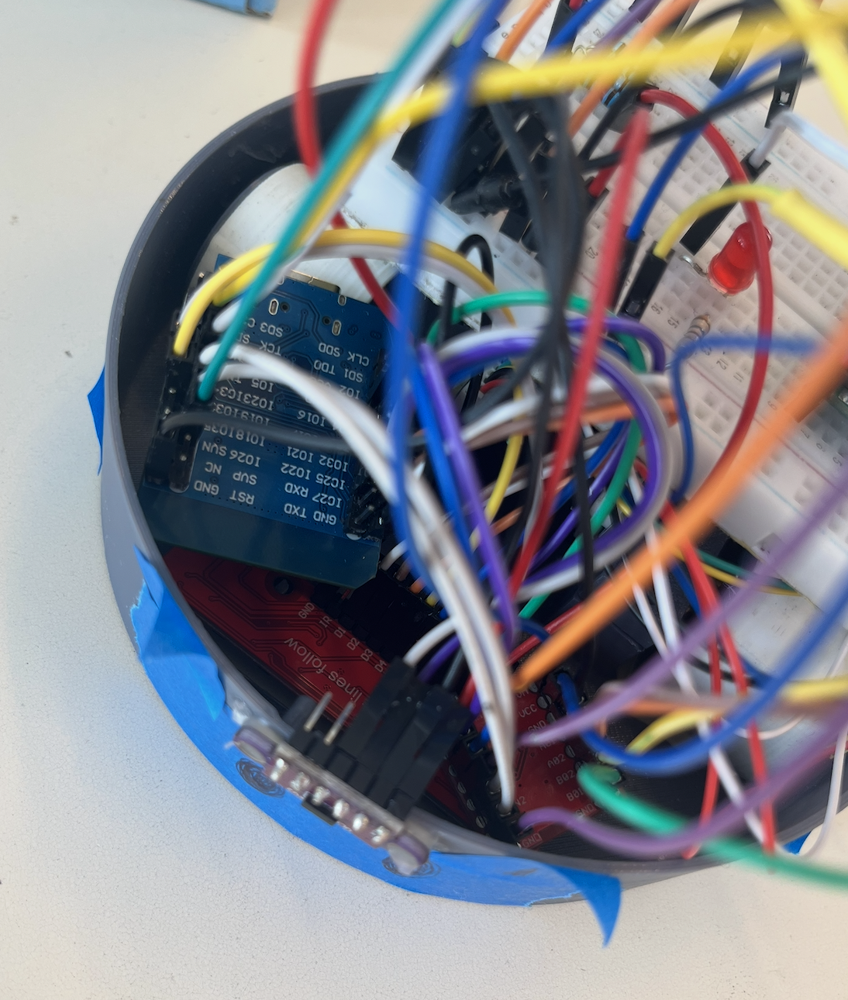

# BillyBob – Autonomous Sumo Robot



## Overview

**BillyBob** is an autonomous Sumo robot developed as an individual project during the first semester of my third year of engineering studies at **Polytech Nice – Université Côte d'Azur**.

The objective of the project was to develop the behaviour of a mobile robot capable of detecting an opponent, searching for it autonomously, pushing it outside the arena and avoiding the arena boundary.

The project was inspired by official Mini-Sumo competitions, with adapted dimensions and simplified specifications.

The mechanical platform and electronic components were provided, while the programming, sensor integration, control strategy, testing and adjustments were carried out individually.

---

## Project Objectives

The development was organised around three progressive levels:

1. **Level 1 – Opponent detection and attack**  
   Detect a stationary opponent and move towards it in order to push it.

2. **Level 2 – Autonomous match behaviour**  
   Search for a moving opponent, engage it and detect the arena boundary.

3. **Level 3 – Improved autonomous strategy**  
   Improve boundary avoidance and adapt the escape manoeuvre according to the position detected by the infrared sensors.

---

## Hardware



The robot was built using:

- ESP32 microcontroller
- Two DC motors and wheels
- VL53L0X Time-of-Flight distance sensor
- 8-channel infrared sensor array
- Motor control electronics
- Breadboard
- Electronic components and jumper wires
- LED used for battery monitoring
- Circular mobile robot platform

---

## Software

The robot was programmed in **C++ using the Arduino framework for ESP32**.

The software also uses **FreeRTOS tasks** to separate the robot's main behaviours.

### Main functionalities

- Opponent detection using a Time-of-Flight distance sensor
- Autonomous opponent-search behaviour
- Forward, backward and rotational motor control
- Arena boundary detection using infrared sensors
- Infrared sensor filtering
- Adaptive escape manoeuvres
- Battery voltage monitoring
- Multitasking using FreeRTOS

---

## Electronics Integration



The project required integrating the sensors, motor control system and electronic components on a compact two-wheel platform.

The different sensors were connected to the ESP32 and used simultaneously to manage both opponent detection and arena boundary detection.

---

## Control Strategy

### Opponent Detection

The **VL53L0X Time-of-Flight sensor** measures the distance in front of the robot.

When an opponent is detected within the defined distance threshold, BillyBob moves forward to attack.

When no opponent is detected, the robot rotates in order to search for one.

---

### Arena Boundary Detection

An array of **eight infrared sensors** is used to detect the edge of the Sumo arena.

The sensor readings are represented as an 8-bit value.

An **Exponential Moving Average (EMA)** filter is used to improve the stability of the infrared sensor readings.

One sensor input was excluded from the decision logic using an error mask because its measurements were unreliable during testing.

---

## Development Stages

### Level 1 – Opponent Detection

The first version focused on basic autonomous fighting behaviour.

The robot was able to:

- Read distance measurements from the VL53L0X sensor
- Move forward when an opponent was detected
- Rotate when no opponent was detected
- Monitor battery voltage using a dedicated FreeRTOS task

The main behaviours were separated into concurrent tasks.

---

### Level 2 – Boundary Detection

The second version introduced the infrared sensor array.

BillyBob was then able to:

- Detect the arena boundary
- Read and process infrared sensor data
- Suspend the fighting behaviour when approaching the edge
- Move backwards to return inside the arena
- Resume opponent-search behaviour afterwards
- Continue monitoring the battery

Three FreeRTOS tasks were used:

- **Fight Task**
- **Border Task**
- **Battery Task**

---

### Level 3 – Adaptive Escape Strategy

The final version introduced a more advanced boundary avoidance strategy.

The eight infrared sensors were divided into three detection zones:

- **Left**
- **Centre**
- **Right**

Depending on which zone detects the arena boundary, BillyBob performs a different escape manoeuvre.

For example:

- Detection on the **left** leads to a backward movement followed by a corrective rotation.
- Detection on the **right** results in the opposite rotation.
- Detection in the **centre** triggers a backward movement followed by reorientation.
- When several sensors detect an unclear situation, a longer escape manoeuvre is used.

During an escape manoeuvre, the fighting task is temporarily suspended so that boundary avoidance takes priority.

---

## FreeRTOS Architecture

The final version mainly relies on two concurrent tasks:

### Fight Task

Responsible for:

- Reading the VL53L0X distance sensor
- Searching for an opponent
- Attacking when an opponent is detected

### Border Task

Responsible for:

- Reading the infrared sensor array
- Processing filtered sensor data
- Detecting the arena boundary
- Temporarily suspending the Fight Task
- Performing the appropriate escape manoeuvre
- Resuming the Fight Task afterwards

This architecture allows safety-related boundary detection to take priority over the attack behaviour.

---

## Challenges & Improvements

One of the main difficulties encountered during testing concerned the infrared sensor array.

Because the robot used only two wheels, its body tended to tilt slightly backwards. This increased the distance between the infrared sensors and the floor and made boundary detection less reliable.

To improve the physical positioning of the sensors, I designed and **3D-printed a small plastic support** that tilted the robot slightly forward and brought the infrared sensors closer to the ground.

This project therefore required not only programming, but also experimentation and adaptation of the physical robot based on observed behaviour.

Another challenge was dealing with unreliable infrared readings. The software therefore included:

- Sensor filtering
- A sensor error mask
- Progressive testing of different boundary-avoidance strategies

---

## Project Structure

```text
billybob-sumo-robot/
│
├── README.md
│
├── images/
│   ├── billybob-overview.png
│   ├── billybob-top-view.png
│   └── billybob-electronics.png
│
├── BillyBob_Level1/
│   ├── BillyBob_Level1.ino
│   ├── Motors.cpp
│   └── Motors.h
│
├── BillyBob_Level2/
│   ├── BillyBob_Level2.ino
│   ├── Motors.cpp
│   ├── Motors.h
│   ├── IR_Sensors.cpp
│   └── IR_Sensors.h
│
└── BillyBob_Level3/
    ├── BillyBob_Level3.ino
    ├── Motors.cpp
    ├── Motors.h
    ├── IR_Sensors.cpp
    └── IR_Sensors.h